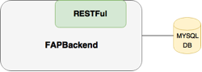

#System specification

## 1. User Stories

1. As a User I want to see the newest available data from transtats displayed in bar-graph form so that I can analyse the data to determine the best flight routes for the company.
2. As a User I want to configure the X-Axis of the graph to display one of the qualitative features TIME (day of week), destination, origin so that I can adapt the graph for my current needs.
3. As a User I want to configure the Y-Axis of the graph to display one of the quantitative features Flights, Passengers, Delays, DelayDuration, Cancellations so that I can adapt the graph for my current needs.
4. As a User I want to export the graph to PDF so that I can save my current graph.
5. As a User I want to save my graph configurations to easily continue working on different analysations.
6. As a User I want to publicly share configurations with my colleagues to analyse stuff together.

## 2. Technical Requirements
### 2.1. GUI
The Frontend of the application will be implemented as a website using the Polymer framework. It will feature a simple, feature-rich and nice looking user interface. The user will be able to perform all neccessary actions needed for analysing the perfect flight routes.

### 2.2. Backend
The Backend holds the Data from transtats. (User Story 1) The Data will be saved into an existing MySQL database. The backend provides an RESTFul interface to access the saved data.

All CRUD Operations will be available on the interface. (Create, Read, Update, Delete). In addition to that the interface provides a method to filter the data (User Story 2, 3) and a method to save the filter configurations from user (User Story 5).

### 2.3. Crawler
The CTS-Subsystem gains the page for requested data and send them over REST to the backend. It will probably be realized in python.

It will run as a monthly cronjob to ensure the data is up to date. When new data is published on the transtats page between the intervals the crawler will activate itself to ensure the newest data is available.
## 3. Project Scope
* Read and save data from transtats
* Show data in GUI
* Filter Data
* Deploy the whole system on a CentOS Server

## 4. Not included in Project Scope
* Build the CentOS Server
* Build the MySQL database
