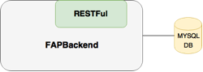

#System specification

## 1. User Stories
### Summary
1. As a User I want to see the newest available data from transtats displayed in bar-graph form so that I can analyse the data to determine the best flight routes for the company.
2. As a User I want to configure the X-Axis of the graph to display one of the qualitative features time (year, month, week, day of week), destination, origin so that I can adapt the graph for my current needs.
3. As a User I want to configure the Y-Axis of the graph to display one of the quantitative features Flights, Passengers, Delays, DelayDuration, Cancellations so that I can adapt the graph for my current needs.
4. As a User I want to export the graph to PDF so that I can save my current graph.
5. As a User I want to save my graph configurations to easily continue working on different analysations.
6. As a User I want to publicly share configurations with my colleagues to analyse stuff together.

### Done
User Story 1-6

### Open
None

## 2. Technical Requirements
### 2.1. GUI
The Frontend of the application will be implemented as a website using the Polymer framework. It will feature a simple, feature-rich and nice looking user interface. The user will be able to perform all necessary actions needed for analysing the flight routes.

### 2.2. Backend
The Backend holds the Data from transtats. (User Story 1) The Data will be saved into an existing MySQL database. The backend provides an RESTFul interface to access the saved data.

\ 

All CRUD Operations will be available on the interface. (Create, Read, Update, Delete). In addition to that the interface provides a method to filter the data (User Story 2, 3) with a given setting (See data model) and a method to save and load the filter settings (User Story 5 + 6).

### 2.3. Crawler
The CTS-Subsystem gains the page for requested data and send them over to the backend by using REST commands. It is implemented in Java, making use of the Spring framework.

\ 

Each user can activate the crawler via the sidebar menu. There is a selector, which allows the user to select the month to be crawled. After the "Start Crawling" Button is pressed, the crawler gets active and a notification is displayed when the crawler has finished. After that, all users have access to the newly crawled data.

## 3. Project Scope
* Read and save data from transtats
* Show data in GUI
* Filter Data
* Deploy the whole system on a CentOS Server

## 4. Not included in Project Scope
* Set up the CentOS Server
* Set up the MySQL database
