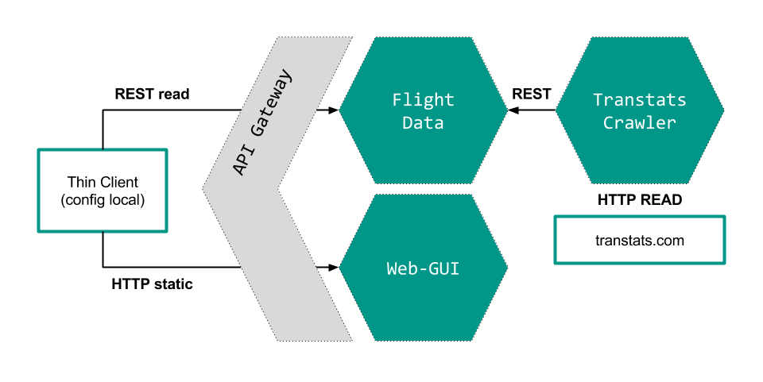
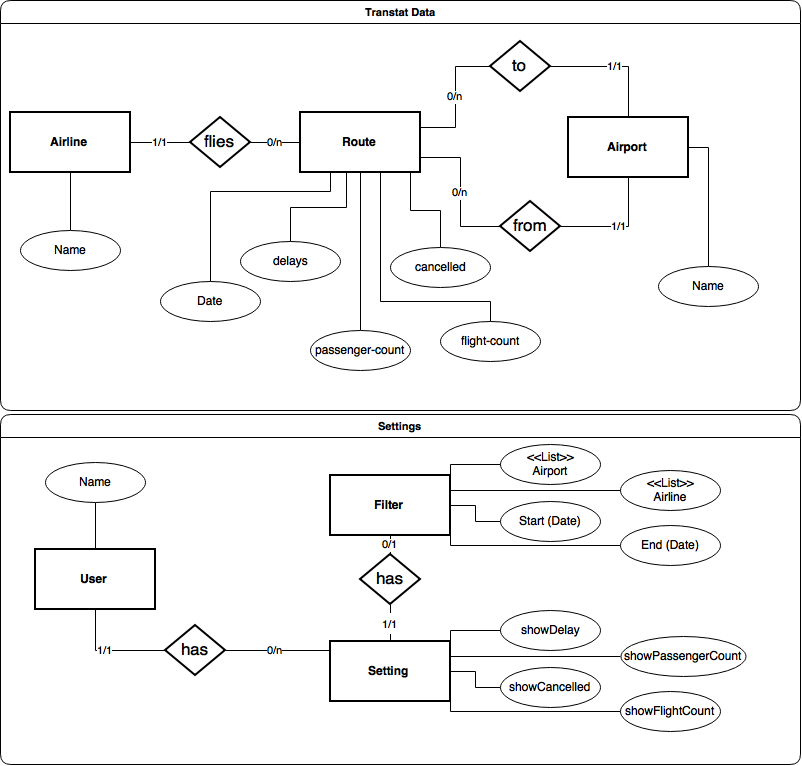

% Architectural Design

# Architecture

\

The Architecture follows the Microservice Architecture and decomposes the whole application into three major Services that are interconnected by a Hypermedia API (REST maturity 3) and the required infrastructure components.

The **Flight Data Service** provides an API for storing the relevant Flight Data and accessing it. This service ensures integrity and validity of the Data. Additionally it saves the global User Configurations.

**Programming language:** Java

**Core technologies:** Spring, MySQL

The **Transtats Crawler Service** provides the functionality to read the current transtats.com Data, transform it as necessary and store it to the Flight Data Service.

**Programming language:** Java

**Core technologies:** Spring

The **Web-GUI** delivers a static (not-templated!) HTML + JS webpage that can be used by the Thin Client as the user frontend. It can make REST requests to the API.

**Programming language:** JavaScript, HTML

**Core technologies:** Polymer

The **API Gateway** unifies the public API and opens it up to the network on port 80. It may also be used to restrict requests for security reasons (e.g. allow only read on flights).

**Programming language:** Java

**Core technologies:** Spring, Zuul

# Data Model

\

The data model is split into two scopes: Transtats data and Settings.

## Transtats data

The first scope describes the data to save from transtats. This data will be provided from the Crawler Service and is used from the GUI to show the graphs. The most important part is the route entity. It has all the quantitive data (delays, flight count, passenger count, ...) to show in the graphs. In addition to that the route has 3 relations to the qualitative data (airport, source, destination).

## Settings

The second scope describes the saved settings data of a specific user. Users can save this data to hold or share a fully configured graph.
