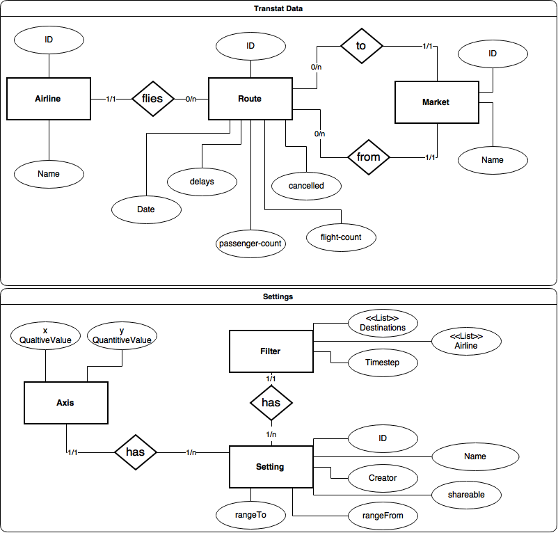

% Architectural Design

# Architecture

\ 

The Architecture follows the Microservice Architecture and decomposes the whole application into three major Services that are interconnected by a Hypermedia API (REST maturity 3) and the required infrastructure components.

The **Flight Data Service** provides an API for storing the relevant Flight Data and accessing it. This service ensures integrity and validity of the Data. Additionally it saves the global User Configurations.

The **Transtats Crawler Service** provides the functionality to read the current transtats.com Data, transform it as necessary and store it to the Flight Data Service.

The **Web-GUI** delivers a static (not-templated!) HTML + JS webpage that can be used by the Thin Client as the user frontend. It can make REST requests to the API.

The **API Gateway** unifies the public API and opens it up to the network on port 80. It may also be used to restrict requests for security reasons (e.g. allow only read on flights).

# Data Model

\ 
