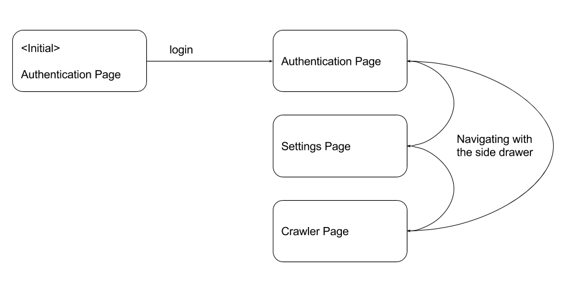
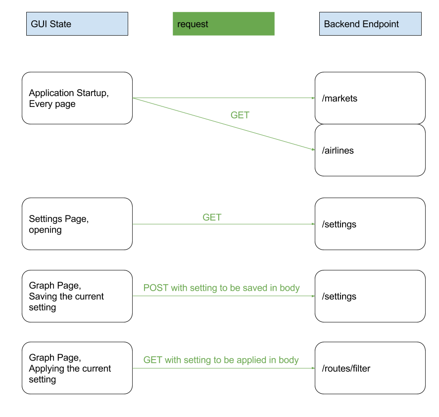
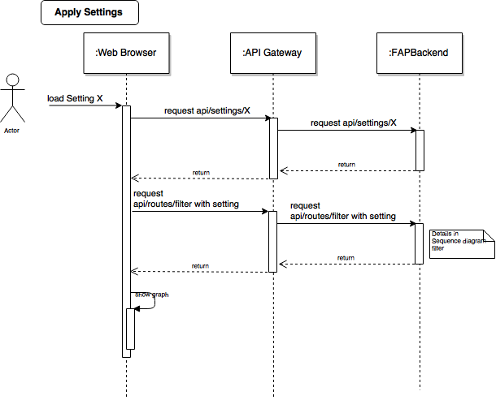
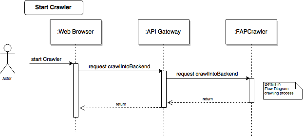
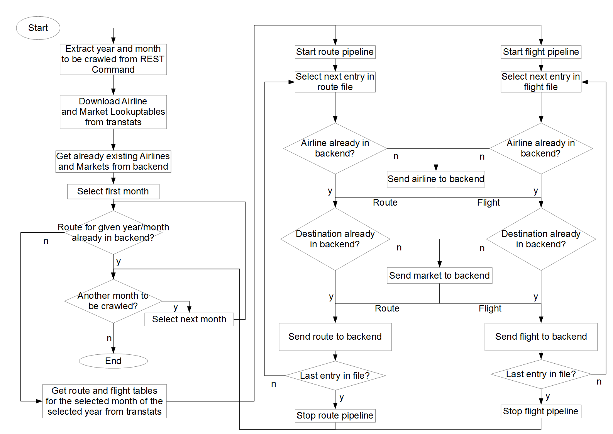

# Technical Documentation
## GUI

The GUI offers a visual representation for the backends API which is described further down in this document. The only data which is stored locally is the last entered username of the user. This username is stored inside a cookie called `username` but is not needed for the correct functionality of the application.

The application can be in one of four different states during use:

/ 

The following flowchart displays the requests from the frontend in the different states. A refresh in the browser restarts these requests.

/ 

The next sequence diagram shows the background workflow of loading and automatically applying a setting.

/ 

With the GUI the user can start the crawler to fetch the latest
data from transtats. This is shown in the next sequence diagram.

/ 

## Backend

The Backend holds the whole data and offers an API for it.
The following section will describe this API.
For every Entity on the database the necessary endpoints
(Path) will be shown with the depending HTTP Methods to call.

Base URL: `http://10.28.2.166/api`

### API Overview
| Entity  | Path                          | HTTP Methods     |
|---------|-------------------------------|------------------|
| Airline | /airlines                     | GET, POST        |
| Airline | /airlines/{id}                | GET, PUT, DELETE |
| Market  | /markets                      | GET, POST        |
| Market  | /markets/{id}                 | GET, PUT, DELETE |
| Route   | /routes                       | GET, POST        |
| Route   | /routes/{id}                  | GET, PUT, DELETE |
| Route   | /routes/saveAll               | POST             |
| Route   | /routes/search/isRouteInMonth | GET              |
| Route   | /routes/filter                | GET              |

### Airline
#### Entity Schema
| Property  | Type   | Required  |
|-----------|--------|-----------|
| id        | String | yes       |
| name      | String | yes       |

#### Path `/airlines`

##### Http Methods
###### ***`Get`***

**Description:** Get all saved airlines.

**Response Example:**
```
Code 200
```
```
[
  {
    "id": "213123",
    "name": "Lufthansa"
  },
  {
    "id": "12312",
    "name": "AirBerlin"
  }
]
```
###### ***`Post`***

**Description:** Save an airline.

**Request Example:**

Header: Content-Type application/json
```
{
  "id": "213123",
  "name": "Lufthansa"
}
```

**Response Example:**
```
Code 201
```
```
{
  "id": "213123",
  "name": "Lufthansa"
}
```
#### Path `/airlines/{id}`

##### Http Methods
###### ***`Get`***

**Description:** Get an specific airline with the given `id`.

**Response Example:**
```
Code 200
```
```
{
    "id": "213123",
    "name": "Lufthansa"
}
```
###### ***`Put`***

**Description:** Update an specific airline with the given `id`.

**Request Example:**

Header: Content-Type application/json
```
{
  "id": "213123",
  "name": "Lufthansa"
}
```

**Response Example:**
```
Code 200
```
```
{
  "id": "213123",
  "name": "Lufthansa"
}
```
###### ***`Delete`***

**Description:** Deletes an specific airline with the given `id`.

**Response Example:**
```
Code 204
```
### Market
#### Entity Schema
| Property  | Type   | Required  |
|-----------|--------|-----------|
| id        | String | yes       |
| name      | String | yes       |

#### Path `/markets`

##### Http Methods
###### ***`Get`***

**Description:** Get all saved markets.

**Response Example:**
```
Code 200
```
```
[
  {
    "id": "213123",
    "name": "New York"
  },
  {
    "id": "12312",
    "name": "Colorado"
  }
]
```
###### ***`Post`***

**Description:** Save a market.

**Request Example:**

Header: Content-Type application/json
```
{
  "id": "213123",
  "name": "New York"
}
```

**Response Example:**
```
Code 201
```
```
{
  "id": "213123",
  "name": "New York"
}
```
#### Path `/markets/{id}`

##### Http Methods
###### ***`Get`***

**Description:** Get a specific market with the given `id`.

**Response Example:**
```
Code 200
```
```
{
    "id": "213123",
    "name": "New York"
}
```
###### ***`Put`***

**Description:** Update a specific market with the given `id`.

**Request Example:**

Header: Content-Type application/json
```
{
  "id": "213123",
  "name": "New York"
}
```

**Response Example:**
```
Code 200
```
```
{
  "id": "213123",
  "name": "New York"
}
```
###### ***`Delete`***

**Description:** Deletes a specific market with the given `id`.

**Response Example:**
```
Code 204
```
### Route
#### Entity Schema
| Property      | Type         | Required  |
|----------------|-------------|-----------|
| id             | String      | no        |
| date           | Date/String | yes       |
| delays         | double      | no        |
| cancelled      | double      | no        |
| passengerCount | double      | no        |
| flightCount    | double      | no        |
| airline        | Link        | yes       |
| source         | Link        | yes       |
| destination    | Link        | yes       |

#### Path `/routes`

##### Http Methods
###### ***`Get`***

**Description:** Get all saved routes.

**Response Example:**
```
Code 200
```
```
[
  {
    "date": "2015-12-01",
    "delays": 10,
    "cancelled": 0,
    "passengerCount": 130,
    "flightCount": 1,
    "airline": "http://10.28.2.166/api/airlines/123123",
    "source": "http://10.28.2.166/api/markets/23423424",
    "destination": "http://10.28.2.166/api/markets/1231231"
  },
  {
    "date": "2015-10-20",
    "delays": 15,
    "cancelled": 0,
    "passengerCount": 120,
    "flightCount": 1,
    "airline": "http://10.28.2.166/api/airlines/123123",
    "source": "http://10.28.2.166/api/markets/23423424",
    "destination": "http://10.28.2.166/api/markets/1231231"
  }
]
```
###### ***`Post`***

**Description:** Save a route.

**Request Example:**

Header: Content-Type application/json
```
{
  "date": "2015-12-01",
  "delays": 10,
  "cancelled": 0,
  "passengerCount": 130,
  "flightCount": 1,
  "airline": "http://10.28.2.166/api/airlines/123123",
  "source": "http://10.28.2.166/api/markets/23423424",
  "destination": "http://10.28.2.166/api/markets/1231231"
}
```

**Response Example:**
```
Code 201
```
```
{
  "date": "2015-12-01",
  "delays": 10,
  "cancelled": 0,
  "passengerCount": 130,
  "flightCount": 1,
  "airline": "http://10.28.2.166/api/airlines/123123",
  "source": "http://10.28.2.166/api/markets/23423424",
  "destination": "http://10.28.2.166/api/markets/1231231"
}
```
#### Path `/routes/saveAll`

##### Http Methods
###### ***`Post`***

**Description:** Saves a list of routes.

**Request Example:**

Header: Content-Type application/json
```
[
  {
    "date": "2015-12-01",
    "delays": 10,
    "cancelled": 0,
    "passengerCount": 130,
    "flightCount": 1,
    "airline": "123123",
    "source": "23423424",
    "destination": "1231231"
  },
  {
    "date": "2015-10-20",
    "delays": 15,
    "cancelled": 0,
    "passengerCount": 120,
    "flightCount": 1,
    "airline": "123123",
    "source": "23423424",
    "destination": "1231231"
  }
]
```

**Response Example:**
```
Code 200
```
#### Path `/routes/search/isRouteInMonthOfYear`

##### Http Methods
###### ***`Get`***

**Description:** Determine if there are already routes saved for
the given month of year.

**Query**

* **date** Date to check with format: yyyy-MM

**Response Example:**
```
Code 200
```
```
true
```

#### Path `/routes/{id}`

##### Http Methods
###### ***`Get`***

**Description:** Get a specific route with the given `id`.

**Response Example:**
```
Code 200
```
```
{
  "date": "2015-12-01",
  "delays": 10,
  "cancelled": 0,
  "passengerCount": 130,
  "flightCount": 1,
  "airline": "http://10.28.2.166/api/airlines/123123",
  "source": "http://10.28.2.166/api/markets/23423424",
  "destination": "http://10.28.2.166/api/markets/1231231"
}
```
###### ***`Put`***

**Description:** Update a specific route with the given `id`.

**Request Example:**

Header: Content-Type application/json
```
{
  "date": "2015-12-01",
  "delays": 10,
  "cancelled": 0,
  "passengerCount": 130,
  "flightCount": 1,
  "airline": "http://10.28.2.166/api/airlines/123123",
  "source": "http://10.28.2.166/api/markets/23423424",
  "destination": "http://10.28.2.166/api/markets/1231231"
}
```

**Response Example:**
```
Code 200
```
```
{
  "date": "2015-12-01",
  "delays": 10,
  "cancelled": 0,
  "passengerCount": 130,
  "flightCount": 1,
  "airline": "http://10.28.2.166/api/airlines/123123",
  "source": "http://10.28.2.166/api/markets/23423424",
  "destination": "http://10.28.2.166/api/markets/1231231"
}
```
###### ***`Delete`***

**Description:** Deletes a specific route with the given `id`.

**Response Example:**
```
Code 204
```
#### Path `/routes/filter`

##### Http Methods
###### ***`Get`***

**Description:** Apply a given filter setting to the database and
provide preformatted data.

This action is not a simple database request and
includes business logic. The following sequence diagram describes this logic:

\ 

**Request Example:**

Header: Content-Type application/json
```
{
  "name": "Test-View",
  "creator": "Hans",
  "shareable": true,
  "rangeFrom": "2015-01-01",
  "rangeTo": "2015-03-31",
  "filter": {
    "destinations": [
      "23123123","2313123123"
    ],
    "airlines": [
      "678678","6786786867"
    ],
    "timestep": "MONTH"
    },
  "axis": {
    "x": "TIME",
    "y": "FLIGHTS"
  }
}
```

**Response Example:**
```
Code 200
```
```
{
  "y": "FLIGHTS",
  "z": "TIME",
  "x": "January, February, March",
  "data":{
    "January": 20,
    "February": 15,
    "March": 21
  }
}
```

### Settings
#### Entity Schema
| Property  | Type        | Required |
|-----------|-------------|----------|
| id        | String      | no       |
| name      | String      | yes      |
| creator   | String      | yes      |
| shareable | boolean     | no       |
| rangeFrom | Date/String | no       |
| rangeTo   | Date/String | no       |
| filter    | Filter      | yes      |
| axis      | Axis        | yes      |

#### Path `/settings`

##### Http Methods
###### ***`Get`***

**Description:** Get all saved settings.

**Response Example:**
```
Code 200
```
```
[
  {
    "name": "Standard-View",
    "creator": "Hans",
    "shareable": true,
    "rangeFrom": "2015-01-01",
    "rangeTo": "2015-12-31",
    "filter": {
      "destinations": [
        "23123123","2313123123"
      ],
      "airlines": [
        "678678","6786786867"
      ],
      "timestep": "MONTH"
      },
    "axis": {
      "x": "TIME",
      "y": "FLIGHTS"
    }
  },
  {
    "name": "Extended-View",
    "creator": "Hans",
    "shareable": true,
    "rangeFrom": "2015-01-01",
    "rangeTo": "2015-01-31",
    "filter": {
      "destinations": [
        "23123123","2313123123"
      ],
      "airlines": [
        "678678","6786786867"
      ],
      "timestep": "DAY_OF_WEEK"
      },
    "axis": {
      "x": "DESTINATION",
      "y": "PASSENGERS"
    }
  }
]
```
###### ***`Post`***

**Description:** Save a setting.

**Request Example:**

Header: Content-Type application/json
```
{
  "name": "Standard-View",
  "creator": "Hans",
  "shareable": true,
  "rangeFrom": "2015-01-01",
  "rangeTo": "2015-12-31",
  "filter": {
    "destinations": [
      "23123123","2313123123"
    ],
    "airlines": [
      "678678","6786786867"
    ],
    "timestep": "MONTH"
    },
  "axis": {
    "x": "TIME",
    "y": "FLIGHTS"
  }
}
```

**Response Example:**
```
Code 201
```
```
{
  "name": "Standard-View",
  "creator": "Hans",
  "shareable": true,
  "rangeFrom": "2015-01-01",
  "rangeTo": "2015-12-31",
  "filter": {
    "destinations": [
      "23123123","2313123123"
    ],
    "airlines": [
      "678678","6786786867"
    ],
    "timestep": "MONTH"
    },
  "axis": {
    "x": "TIME",
    "y": "FLIGHTS"
  }
}
```
#### Path `/settings/{id}`

##### Http Methods
###### ***`Get`***

**Description:** Get a specific setting with the given `id`.

**Response Example:**
```
Code 200
```
```
{
  "name": "Standard-View",
  "creator": "Hans",
  "shareable": true,
  "rangeFrom": "2015-01-01",
  "rangeTo": "2015-12-31",
  "filter": {
    "destinations": [
      "23123123","2313123123"
    ],
    "airlines": [
      "678678","6786786867"
    ],
    "timestep": "MONTH"
    },
  "axis": {
    "x": "TIME",
    "y": "FLIGHTS"
  }
}
```
###### ***`Put`***

**Description:** Update a specific setting with the given `id`.

**Request Example:**

Header: Content-Type application/json
```
{
  "name": "Standard-View",
  "creator": "Hans",
  "shareable": true,
  "rangeFrom": "2015-01-01",
  "rangeTo": "2015-12-31",
  "filter": {
    "destinations": [
      "23123123","2313123123"
    ],
    "airlines": [
      "678678","6786786867"
    ],
    "timestep": "MONTH"
    },
  "axis": {
    "x": "TIME",
    "y": "FLIGHTS"
  }
}
```

**Response Example:**
```
Code 200
```
```
{
  "name": "Standard-View",
  "creator": "Hans",
  "shareable": true,
  "rangeFrom": "2015-01-01",
  "rangeTo": "2015-12-31",
  "filter": {
    "destinations": [
      "23123123","2313123123"
    ],
    "airlines": [
      "678678","6786786867"
    ],
    "timestep": "MONTH"
    },
  "axis": {
    "x": "TIME",
    "y": "FLIGHTS"
  }
}
```
###### ***`Delete`***

**Description:** Deletes a specific setting with the given `id`.

**Response Example:**
```
Code 204
```
#### Path `/settings/search/
findByNameContainingIgnoreCaseOrCreatorContainingIgnoreCase`

##### Http Methods
###### ***`Get`***

**Description:** Find settings by name or by creator name.

**Query**

* **name** Name of setting
* **creator** Name of creator

**Response Example:**
```
Code 200
```
```
[
  {
    "name": "Standard-View",
    "creator": "Hans",
    "shareable": true,
    "rangeFrom": "2015-01-01",
    "rangeTo": "2015-12-31",
    "filter": {
      "destinations": [
        "23123123","2313123123"
      ],
      "airlines": [
        "678678","6786786867"
      ],
      "timestep": "MONTH"
      },
    "axis": {
      "x": "TIME",
      "y": "FLIGHTS"
    }
  }
]
```
#### Path `/settings/search/
findByCreatorContainingIgnoreCaseOrShareableTrue`

##### Http Methods
###### ***`Get`***

**Description:** Find settings by creator name including all
public settings.

**Query**

* **creator** Name of creator

**Response Example:**
```
Code 200
```
```
[
  {
    "name": "Standard-View",
    "creator": "Hans",
    "shareable": true,
    "rangeFrom": "2015-01-01",
    "rangeTo": "2015-12-31",
    "filter": {
      "destinations": [
        "23123123","2313123123"
      ],
      "airlines": [
        "678678","6786786867"
      ],
      "timestep": "MONTH"
      },
    "axis": {
      "x": "TIME",
      "y": "FLIGHTS"
    }
  }
]
```

## Crawler
### Format of the downloaded Tables from transtats


#### Airline Lookup table
* AirlineID
http://transtats.bts.gov/Download_Lookup.asp?Lookup=L_AIRLINE_ID  

##### Example
`http.Get("http://transtats.bts.gov/Download_Lookup.asp?Lookup=L_AIRLINE_ID")`
```csv
Code,Description
"19031","Mackey International Inc.: MAC"
"19032","Munz Northern Airlines Inc.: XY"
"19033","Cochise Airlines Inc.: COC"
"19034","Golden Gate Airlines Inc.: GSA"
"19035","Aeromech Inc.: RZZ"
"19036","Golden West Airlines Co.: GLW"
"19037","Puerto Rico Intl Airlines: PRN"
"19038","Air America Inc.: STZ"
"19039","Swift Aire Lines Inc.: SWT"
```
```json
{
	"name": "string[[Description]]",
	"id": "int[[Code]]"
}
```

#### Market Lookup table
* Dest/OriginCityMarketID
http://transtats.bts.gov/Download_Lookup.asp?Lookup=L_CITY_MARKET_ID  

##### Example
`http.Get("http://transtats.bts.gov/Download_Lookup.asp?Lookup=L_CITY_MARKET_ID")`
```csv
Code,Description
"30001","Afognak Lake, AK"
"30003","Granite Mountain, AK"
"30004","Lik, AK"
"30005","Little Squaw, AK"
"30006","Kizhuyak, AK"
"30007","Klawock, AK"
"30008","Elizabeth Island, AK"
"30009","Homer, AK"
"30010","Hudson, NY"
```
```json
{
	"name": "string[[Description]]",
	"id": "int[[Code]]"
}
```

#### Route table
* T-100 Domestic Segment (All Carriers)  
http://transtats.bts.gov/DL_SelectFields.asp?Table_ID=311   

```
"YEAR","MONTH","DEPARTURES_SCHEDULED","DEPARTURES_PERFORMED","PASSENGERS","AIRLINE_ID","ORIGIN_CITY_MARKET_ID","DEST_CITY_MARKET_ID",

```

##### Example

```
form := url.Values{"sqlstr": {"SELECT YEAR,MONTH,DEPARTURES_SCHEDULED,DEPARTURES_PERFORMED,PASSENGERS,AIRLINE_ID,
									ORIGIN_CITY_MARKET_ID,DEST_CITY_MARKET_ID,MONTH
							   FROM  T_T100D_SEGMENT_ALL_CARRIER
							   AND YEAR=[[year]]
                 AND MONTH=[[month]]
							   AND ORIGIN_CITY_MARKET_ID=31703"}}
http.PostForm("http://transtats.bts.gov/DownLoad_Table.asp", form)
```

```csv
"DEPARTURES_SCHEDULED","DEPARTURES_PERFORMED","PASSENGERS","AIRLINE_ID","ORIGIN_CITY_MARKET_ID","DEST_CITY_MARKET_ID","MONTH",
0.00,1.00,0.00,21107,31703,31703,2,
0.00,1.00,0.00,21492,31703,31995,2,
0.00,1.00,0.00,21492,31703,31703,2
```

```json
{
	"date": "string[[YEAR]]-[[MONTH]]-01",
	"delays": "0",
	"cancelled": "0",
	"passengerCount": "double[[PASSENGERS]]",
	"flightCount": "0",
	"airline": "hal+id[[AIRLINE_ID]]",
	"source": "hal+id[[ORIGIN_CITY_MARKET_ID]]",
	"destination": "hal+id[[DEST_CITY_MARKET_ID]]"
}
```


#### Flights table
* On-Time Performance
http://transtats.bts.gov/DL_SelectFields.asp?Table_ID=236  

```
"DAY_OF_WEEK","FL_DATE","AIRLINE_ID","ORIGIN_CITY_MARKET_ID","DEST_CITY_MARKET_ID","ARR_DELAY_NEW","CANCELLED",

```

##### Example

```
form := url.Values{"sqlstr": {"SELECT DAY_OF_WEEK,FL_DATE,AIRLINE_ID,ORIGIN_CITY_MARKET_ID,DEST_CITY_MARKET_ID,
									ARR_DELAY_NEW,CANCELLED
							   FROM T_ONTIME
							   WHERE Month=[[month]]
							   AND YEAR=[[year]]
							   AND ORIGIN_CITY_MARKET_ID=31703"}}
http.PostForm("http://transtats.bts.gov/DownLoad_Table.asp", form)
```

```csv
"DAY_OF_WEEK","FL_DATE","AIRLINE_ID","ORIGIN_CITY_MARKET_ID","DEST_CITY_MARKET_ID","ARR_DELAY_NEW","CANCELLED",
1,2015-02-02,19805,31703,32575,,1.00,
1,2015-02-09,19805,31703,32575,22.00,0.00,
1,2015-02-16,19805,31703,32575,0.00,0.00,
1,2015-02-23,19805,31703,32575,9.00,0.00
```

```json
{
	"date": "string[[FL_DATE]]",
	"delays": "double[[ARR_DELAY_NEW]]",
	"cancelled": "double[[CANCELLED]]",
	"passengerCount": "0",
	"flightCount": "1",
	"airline": "hal+id[[AIRLINE_ID]]",
	"source": "hal+id[[ORIGIN_CITY_MARKET_ID]]",
	"destination": "hal+id[[DEST_CITY_MARKET_ID]]"
}
```


### Flowchart for the crawling process
\ 

#### Detailed listing of the proceedings of the crawling process
1. Start the crawler via a REST command, either by using the "Crawler"-Button in
 the GUI or by just sending the command to http://10.28.2.166/crawler.  
The command has the following syntax: http://\<serverIPAddress/crawler\>/crawlIntoBackend?year=\<year\>(&month=\<month\>)  
The year must be a number, so must the month. If just the year is provided, the full year will be crawled.  
Months can be given as discrete months or in ranges, e.g. 1-7.  
The part in () brackets is optional.  
2. The crawler now starts the crawling process. This process is divided in several steps.
3. The list of all airlines available is downloaded from the transtats server and they are saved in a hashmap.
Also all airlines already in the database are requested and saved into a set.
4. The list of all markets available is downloaded from the transtats server and they are saved in a hashmap.
Also all markets already in the database are requested and saved into a set.
5. The given year and month or months, are extracted and a loop is created, starting with the first given month, ending with the last given month.
6. The T100D database is queried for all routes originating in the NYC market, going to other markets in the US, in the first given month.
7. The route pipeline is created.
8. The zip-file containing the routes is extracted entry by entry and pushed into the route pipeline.
9. Routes are created from the given entry.
10. Invalid routes are filtered.
11. Airlines and markets used in the created route and not already in the database are written into the database.
12. The route is written into the database
13. Step 6 to 12 are done for the on-time-database, now creating (logical) flights instead of routes.
14. If there is more than one month to be crawled, steps 6 to 13 are repeated for every given month.

### Definitions  
* **Route:**  Information available on a monthly base. They contain the number of passengers going from one market to the other in the given month. The information for number of passengers is always given as a route with the date of the first day of the corresponding month.  
* **Flight:**  Information available on a daily base. This contains, for each flight, information about delays and cancellations, as well as the exact date of the flight. Flights also make up the number of flights from one market to another.
* **Market:**  A market includes all airports of a domestic region. E.g. the domestic region New York includes 13 airports.

### Crawler API

Base URL: `http://10.28.2.166/crawler`

#### Path `/crawlIntoBackend`

##### Http Methods
###### ***`Get`***

**Description:** Crawl new data into the backend.

**Query**

* **year** Year to crawl with format: `yyyy`
* **month** Range of months to crawl (optional) with the format: `mm-mm` or `mm`

**Response Example:**
```
Code 200
```
