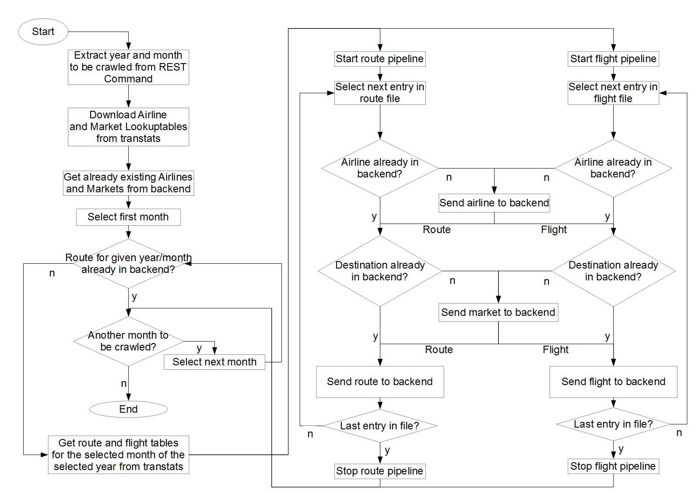

# Technical Documentation
## GUI
## Backend

The Backend holds the whole data and offers an API for it. The following section will describe this API. For every Entity on the database the necessary  endpoints
(Path) will be shown with the depending HTTP Methods to call.

Base URL: `http://10.28.2.166/api`

### Airline
#### Entity Schema
| Property  | Type   | Required  |
|-----------|--------|-----------|
| id        | String | yes       |
| name      | String | yes       |

#### Path `/airlines`

##### Http Methods
###### ***`Get`***

**Description:** Get all saved airlines.

**Response Example:**
```
Code 200
```
```
[
  {
    "id": "213123",
    "name": "Lufthansa"
  },
  {
    "id": "12312",
    "name": "AirBerlin"
  }
]
```
###### ***`Post`***

**Description:** Save an airline.

**Request Example:**
Header: Content-Type application/json
```
{
  "id": "213123",
  "name": "Lufthansa"
}
```

**Response Example:**
```
Code 201
```
```
{
  "id": "213123",
  "name": "Lufthansa"
}
```
#### Path `/airlines/{id}`

##### Http Methods
###### ***`Get`***

**Description:** Get an specific airline with the given `id`.

**Response Example:**
```
Code 200
```
```
{
    "id": "213123",
    "name": "Lufthansa"
}
```
###### ***`Put`***

**Description:** Update an specific airline with the given `id`.

**Request Example:**
Header: Content-Type application/json
```
{
  "id": "213123",
  "name": "Lufthansa"
}
```

**Response Example:**
```
Code 200
```
```
{
  "id": "213123",
  "name": "Lufthansa"
}
```
###### ***`Delete`***

**Description:** Deletes an specific airline with the given `id`.

**Response Example:**
```
Code 204
```
### Market
#### Entity Schema
| Property  | Type   | Required  |
|-----------|--------|-----------|
| id        | String | yes       |
| name      | String | yes       |

#### Path `/markets`

##### Http Methods
###### ***`Get`***

**Description:** Get all saved markets.

**Response Example:**
```
Code 200
```
```
[
  {
    "id": "213123",
    "name": "New York"
  },
  {
    "id": "12312",
    "name": "Colorado"
  }
]
```
###### ***`Post`***

**Description:** Save a market.

**Request Example:**
Header: Content-Type application/json
```
{
  "id": "213123",
  "name": "New York"
}
```

**Response Example:**
```
Code 201
```
```
{
  "id": "213123",
  "name": "New York"
}
```
#### Path `/markets/{id}`

##### Http Methods
###### ***`Get`***

**Description:** Get a specific market with the given `id`.

**Response Example:**
```
Code 200
```
```
{
    "id": "213123",
    "name": "New York"
}
```
###### ***`Put`***

**Description:** Update a specific market with the given `id`.

**Request Example:**
Header: Content-Type application/json
```
{
  "id": "213123",
  "name": "New York"
}
```

**Response Example:**
```
Code 200
```
```
{
  "id": "213123",
  "name": "New York"
}
```
###### ***`Delete`***

**Description:** Deletes a specific market with the given `id`.

**Response Example:**
```
Code 204
```
### Route
#### Entity Schema
| Property      | Type         | Required  |
|----------------|-------------|-----------|
| id             | String      | no        |
| date           | Date/String | yes       |
| delays         | double      | no        |
| cancelled      | double      | no        |
| passengerCount | double      | no        |
| flightCount    | double      | no        |
| airline        | Link        | yes       |
| source         | Link        | yes       |
| destination    | Link        | yes       |

#### Path `/routes`

##### Http Methods
###### ***`Get`***

**Description:** Get all saved routes.

**Response Example:**
```
Code 200
```
```
[
  {
    "date": "2015-12-01",
    "delays": 10,
    "cancelled": 0,
    "passengerCount": 130,
    "flightCount": 1,
    "airline": "http://10.28.2.166/api/airlines/123123",
    "source": "http://10.28.2.166/api/markets/23423424",
    "destination": "http://10.28.2.166/api/markets/1231231"
  },
  {
    "date": "2015-10-20",
    "delays": 15,
    "cancelled": 0,
    "passengerCount": 120,
    "flightCount": 1,
    "airline": "http://10.28.2.166/api/airlines/123123",
    "source": "http://10.28.2.166/api/markets/23423424",
    "destination": "http://10.28.2.166/api/markets/1231231"
  }
]
```
###### ***`Post`***

**Description:** Save a route.

**Request Example:**
Header: Content-Type application/json
```
{
  "date": "2015-12-01",
  "delays": 10,
  "cancelled": 0,
  "passengerCount": 130,
  "flightCount": 1,
  "airline": "http://10.28.2.166/api/airlines/123123",
  "source": "http://10.28.2.166/api/markets/23423424",
  "destination": "http://10.28.2.166/api/markets/1231231"
}
```

**Response Example:**
```
Code 201
```
```
{
  "date": "2015-12-01",
  "delays": 10,
  "cancelled": 0,
  "passengerCount": 130,
  "flightCount": 1,
  "airline": "http://10.28.2.166/api/airlines/123123",
  "source": "http://10.28.2.166/api/markets/23423424",
  "destination": "http://10.28.2.166/api/markets/1231231"
}
```
#### Path `/routes/saveAll`

##### Http Methods
###### ***`Post`***

**Description:** Saves a list of routes.

**Request Example:**
Header: Content-Type application/json
```
[
  {
    "date": "2015-12-01",
    "delays": 10,
    "cancelled": 0,
    "passengerCount": 130,
    "flightCount": 1,
    "airline": "123123",
    "source": "23423424",
    "destination": "1231231"
  },
  {
    "date": "2015-10-20",
    "delays": 15,
    "cancelled": 0,
    "passengerCount": 120,
    "flightCount": 1,
    "airline": "123123",
    "source": "23423424",
    "destination": "1231231"
  }
]
```

**Response Example:**
```
Code 200
```
#### Path `/routes/search/isRouteInMonthOfYear`

##### Http Methods
###### ***`Get`***

**Description:** Determine if there are already routes saved for
the given month of year.

**Query**

* **date** Date to check with format: yyyy-MM

**Response Example:**
```
Code 200
```
```
true
```

#### Path `/routes/{id}`

##### Http Methods
###### ***`Get`***

**Description:** Get a specific route with the given `id`.

**Response Example:**
```
Code 200
```
```
{
  "date": "2015-12-01",
  "delays": 10,
  "cancelled": 0,
  "passengerCount": 130,
  "flightCount": 1,
  "airline": "http://10.28.2.166/api/airlines/123123",
  "source": "http://10.28.2.166/api/markets/23423424",
  "destination": "http://10.28.2.166/api/markets/1231231"
}
```
###### ***`Put`***

**Description:** Update a specific route with the given `id`.

**Request Example:**
Header: Content-Type application/json
```
{
  "date": "2015-12-01",
  "delays": 10,
  "cancelled": 0,
  "passengerCount": 130,
  "flightCount": 1,
  "airline": "http://10.28.2.166/api/airlines/123123",
  "source": "http://10.28.2.166/api/markets/23423424",
  "destination": "http://10.28.2.166/api/markets/1231231"
}
```

**Response Example:**
```
Code 200
```
```
{
  "date": "2015-12-01",
  "delays": 10,
  "cancelled": 0,
  "passengerCount": 130,
  "flightCount": 1,
  "airline": "http://10.28.2.166/api/airlines/123123",
  "source": "http://10.28.2.166/api/markets/23423424",
  "destination": "http://10.28.2.166/api/markets/1231231"
}
```
###### ***`Delete`***

**Description:** Deletes a specific route with the given `id`.

**Response Example:**
```
Code 204
```
#### Path `/routes/filter`

##### Http Methods
###### ***`Get`***

**Description:** Apply a given filter setting to the database and
provide preformatted data.

**Request Example:**
Header: Content-Type application/json
```
{
  "name": "Test-View",
  "creator": "Hans",
  "shareable": true,
  "rangeFrom": "2015-01-01",
  "rangeTo": "2015-03-31",
  "filter": {
    "destinations": [
      "23123123","2313123123"
    ],
    "airlines": [
      "678678","6786786867"
    ],
    "timestep": "MONTH"
    },
  "axis": {
    "x": "TIME",
    "y": "FLIGHTS"
  }
}
```

**Response Example:**
```
Code 200
```
```
{
  "y": "FLIGHTS",
  "z": "TIME",
  "x": "January, February, March",
  "data":{
    "January": 20,
    "February": 15,
    "March": 21
  }
}
```

### Settings
#### Entity Schema
| Property  | Type        | Required |
|-----------|-------------|----------|
| id        | String      | no       |
| name      | String      | yes      |
| creator   | String      | yes      |
| shareable | boolean     | no       |
| rangeFrom | Date/String | no       |
| rangeTo   | Date/String | no       |
| filter    | Filter      | yes      |
| axis      | Axis        | yes      |

#### Path `/settings`

##### Http Methods
###### ***`Get`***

**Description:** Get all saved settings.

**Response Example:**
```
Code 200
```
```
[
  {
    "name": "Standard-View",
    "creator": "Hans",
    "shareable": true,
    "rangeFrom": "2015-01-01",
    "rangeTo": "2015-12-31",
    "filter": {
      "destinations": [
        "23123123","2313123123"
      ],
      "airlines": [
        "678678","6786786867"
      ],
      "timestep": "MONTH"
      },
    "axis": {
      "x": "TIME",
      "y": "FLIGHTS"
    }
  },
  {
    "name": "Extended-View",
    "creator": "Hans",
    "shareable": true,
    "rangeFrom": "2015-01-01",
    "rangeTo": "2015-01-31",
    "filter": {
      "destinations": [
        "23123123","2313123123"
      ],
      "airlines": [
        "678678","6786786867"
      ],
      "timestep": "DAY_OF_WEEK"
      },
    "axis": {
      "x": "DESTINATION",
      "y": "PASSENGERS"
    }
  }
]
```
###### ***`Post`***

**Description:** Save a setting.

**Request Example:**
Header: Content-Type application/json
```
{
  "name": "Standard-View",
  "creator": "Hans",
  "shareable": true,
  "rangeFrom": "2015-01-01",
  "rangeTo": "2015-12-31",
  "filter": {
    "destinations": [
      "23123123","2313123123"
    ],
    "airlines": [
      "678678","6786786867"
    ],
    "timestep": "MONTH"
    },
  "axis": {
    "x": "TIME",
    "y": "FLIGHTS"
  }
}
```

**Response Example:**
```
Code 201
```
```
{
  "name": "Standard-View",
  "creator": "Hans",
  "shareable": true,
  "rangeFrom": "2015-01-01",
  "rangeTo": "2015-12-31",
  "filter": {
    "destinations": [
      "23123123","2313123123"
    ],
    "airlines": [
      "678678","6786786867"
    ],
    "timestep": "MONTH"
    },
  "axis": {
    "x": "TIME",
    "y": "FLIGHTS"
  }
}
```
#### Path `/settings/{id}`

##### Http Methods
###### ***`Get`***

**Description:** Get a specific setting with the given `id`.

**Response Example:**
```
Code 200
```
```
{
  "name": "Standard-View",
  "creator": "Hans",
  "shareable": true,
  "rangeFrom": "2015-01-01",
  "rangeTo": "2015-12-31",
  "filter": {
    "destinations": [
      "23123123","2313123123"
    ],
    "airlines": [
      "678678","6786786867"
    ],
    "timestep": "MONTH"
    },
  "axis": {
    "x": "TIME",
    "y": "FLIGHTS"
  }
}
```
###### ***`Put`***

**Description:** Update a specific setting with the given `id`.

**Request Example:**
Header: Content-Type application/json
```
{
  "name": "Standard-View",
  "creator": "Hans",
  "shareable": true,
  "rangeFrom": "2015-01-01",
  "rangeTo": "2015-12-31",
  "filter": {
    "destinations": [
      "23123123","2313123123"
    ],
    "airlines": [
      "678678","6786786867"
    ],
    "timestep": "MONTH"
    },
  "axis": {
    "x": "TIME",
    "y": "FLIGHTS"
  }
}
```

**Response Example:**
```
Code 200
```
```
{
  "name": "Standard-View",
  "creator": "Hans",
  "shareable": true,
  "rangeFrom": "2015-01-01",
  "rangeTo": "2015-12-31",
  "filter": {
    "destinations": [
      "23123123","2313123123"
    ],
    "airlines": [
      "678678","6786786867"
    ],
    "timestep": "MONTH"
    },
  "axis": {
    "x": "TIME",
    "y": "FLIGHTS"
  }
}
```
###### ***`Delete`***

**Description:** Deletes a specific setting with the given `id`.

**Response Example:**
```
Code 204
```
#### Path `/settings/search/
findByNameContainingIgnoreCaseOrCreatorContainingIgnoreCase`

##### Http Methods
###### ***`Get`***

**Description:** Find settings by name or by creator name.

**Query**

* **name** Name of setting
* **creator** Name of creator

**Response Example:**
```
Code 200
```
```
[
  {
    "name": "Standard-View",
    "creator": "Hans",
    "shareable": true,
    "rangeFrom": "2015-01-01",
    "rangeTo": "2015-12-31",
    "filter": {
      "destinations": [
        "23123123","2313123123"
      ],
      "airlines": [
        "678678","6786786867"
      ],
      "timestep": "MONTH"
      },
    "axis": {
      "x": "TIME",
      "y": "FLIGHTS"
    }
  }
]
```
#### Path `/settings/search/
findByCreatorContainingIgnoreCaseOrShareableTrue`

##### Http Methods
###### ***`Get`***

**Description:** Find settings by creator name including all
public settings.

**Query**

* **creator** Name of creator

**Response Example:**
```
Code 200
```
```
[
  {
    "name": "Standard-View",
    "creator": "Hans",
    "shareable": true,
    "rangeFrom": "2015-01-01",
    "rangeTo": "2015-12-31",
    "filter": {
      "destinations": [
        "23123123","2313123123"
      ],
      "airlines": [
        "678678","6786786867"
      ],
      "timestep": "MONTH"
      },
    "axis": {
      "x": "TIME",
      "y": "FLIGHTS"
    }
  }
]
```


## Crawler
### Format of the downloaded Tables from transtats
#### Airline Lookup table
```
Code,Description
```
An example for a line in the file
```
"19031","Mackey International Inc.: MAC"
```

#### Market Lookup table
```
Code,Description
```
An example for a line in the file
```
"30001","Afognak Lake, AK"
```

#### Route table
```
"YEAR","MONTH","DEPARTURES_SCHEDULED","DEPARTURES_PERFORMED","PASSENGERS","AIRLINE_ID","ORIGIN_CITY_MARKET_ID","DEST_CITY_MARKET_ID",

```
An example for a line in the file
```
2015,1,3.00,3.00,153.00,20378,31703,31057,

```

#### Flights table
```
"DAY_OF_WEEK","FL_DATE","AIRLINE_ID","ORIGIN_CITY_MARKET_ID","DEST_CITY_MARKET_ID","ARR_DELAY_NEW","CANCELLED",

```
An example for a line in the file
```
1,2015-01-05,19805,31703,32575,0.00,0.00,

```


### Flowchart for the crawling process
\ 

### Definitions  
Route = Information available on a monthly base. They contain the number of passengers going from one market to the other in the given month. The information for number of passengers is always given as a route with the date of the first day of the corresponding month.  
Flight = Information available on a daily base. This contains, for each flight, information about delays and cancellations, as well as the exact date of the flight. Flights also make up the number of flights from one market to another.
