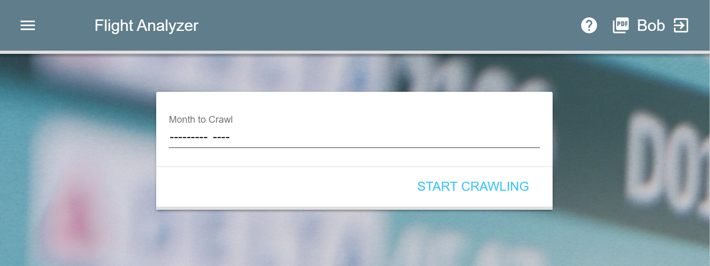
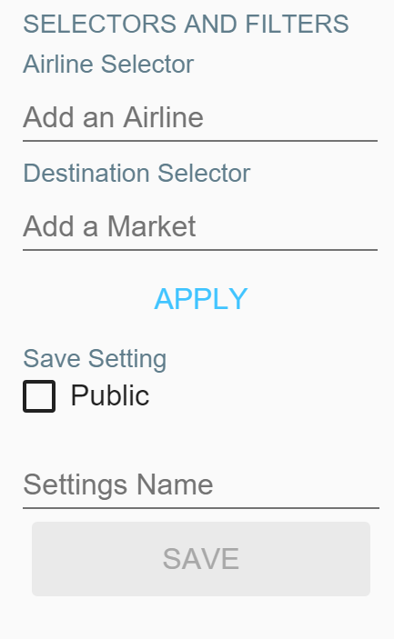

% User Documentation
% for Flight Analyzer
% 15.06.2016

# Getting Started

The **Flight-Analyzer**\textsuperscript{TM} is a normal Web-Application, like `google.com` or `nytimes.com`. So to access it you need any one of these modern Webbrowsers:

> Google Chrome
> : <https://www.google.de/chrome/browser/desktop/> 

> Firefox
> : <https://www.mozilla.org/de/firefox/new/>

> Microsoft Edge
> : <https://www.microsoft.com/de-de/windows/microsoft-edge>

If you already have one of them installed you're good to go. If not you can follow these links to learn more about them and install one.

---

Once you have your browser up and running and are connected to the company network [^1], you can visit the **Flight-Analyzer**\textsuperscript{TM} Application at <http://10.28.2.166/>.

[^1]: Currently, this means you are connected via VPN to the `lrz.de` network of the University of Applied Sciences Munich.

# Logging in

\ 

You are now presented with a splash screen. Here you are asked to insert your Username and click **`START`**. The username will be used to recognize you and store your personal settings.

# The Pages and Navigation

## Graph Page

\ 

Upon first login, you will see the **Graph Page**. This is the main page of the application and allows you to configure the settings for the graph and will show it once you click **`APPLY`**. 

The configuration of the graph will be explained in an additional chapter.

## Navigation

\ 

A click on the top left menu *(hamburger)* button will reveal the menu for changing pages. If you decide to not change the page you can still click on the large grey area and discard this action.

## Settings Page

By selecting `Load Filter` in the Menu, you will see this page. Here you can load any stored filters/settings by selecting them and confirming
the action with the button that appears in the bottom right corner.

\ 

You can also limit the filters by typing into the light grey search field.

## Crawler Page

\ 

Here you can start the Crawler to update the data from the `transtats.com` website. In the input field you have to specify the month to update. To start the crawling process click on **`START CRAWLING`**.

# Graph Configuration

## Basic Configuration

\

In here you can change the most fundamental way how and which data is displayed in the graph.

In the first to fields you select the time range to limit the data. 

With the `Qualitative Value` you can select how the data is grouped. For example by selecting Destination, for each date (or date range) on the X-Axis multiple Bars (for all the different Destinations) will appear.

The `Quantitative Value` simply states what value should be used for the Y-Axis.

The `Time Step` picker sets the length of the period you are interested in. Adjust this Setting if you are interested in accumulated data for a whole year or the specific days of week.

## Selectors and Saving a Setting

\ 

With this Selectors you can additionally limit data by Airline or Destination.

By adding an Airline to the Airline Selector, you tell the application that you are only interested for data of this Airline. You can also set a group (combination) of multiple Airlines. Choosing no Airline results in a collection of data for all Airlines.

The Destination Selector behaves exactly like the Airline Selector. By selecting multiple (or one) Markets the data will be limited to the flights that have these Destinations.

---

The **`APPLY`** button will calculate the data for the current filter settings and display them in the graph.

---

With the **Save Setting** Dialog you can store the current setting (filter) for only your personal use or shared for the whole company (public).

To store the Setting publically you need to check the `Public` box.

In the `Settings Name` field you can choose a fitting name for your Filter.

# Export as PDF

To export the Graph as a PDF simply click the PDF button on the top right in the toolbar. Then you can choose the target folder and name of the PDF an click Save to finish this process.
